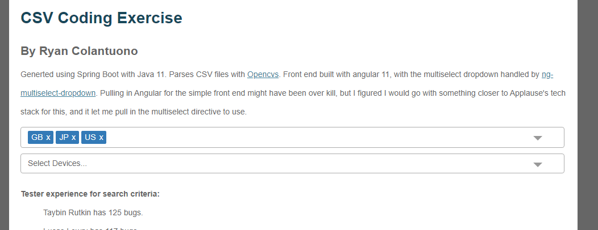

# CSV Coding Exercise
Generted using Spring Boot with Java 11. Parses CSV files with [Opencvs](http://opencsv.sourceforge.net/). Front end built with angular 11, with the multiselect dropdown handled by [ng-multiselect-dropdown](https://github.com/nileshpatel17/ng-multiselect-dropdown). Pulling in Angular for the simple front end might have been over kill, but I figured I would go with something closer to Applause's tech stack for this, and it let me pull in the multiselect directive to use.

After pulling down code, to get it running:
1) Install the angular command line if you don't have it: npm install -g @angular/cli
2) Web dependencies: in src/main/web run 'npm install'
3) Backend dependencies/build jar: in root folder run 'mvn package'
4) Start server off of jar: in root folder run 'java -jar target/csvdemo-0.0.1-SNAPSHOT.jar'

Afterwards app should be running and available on http://localhost:8080/

